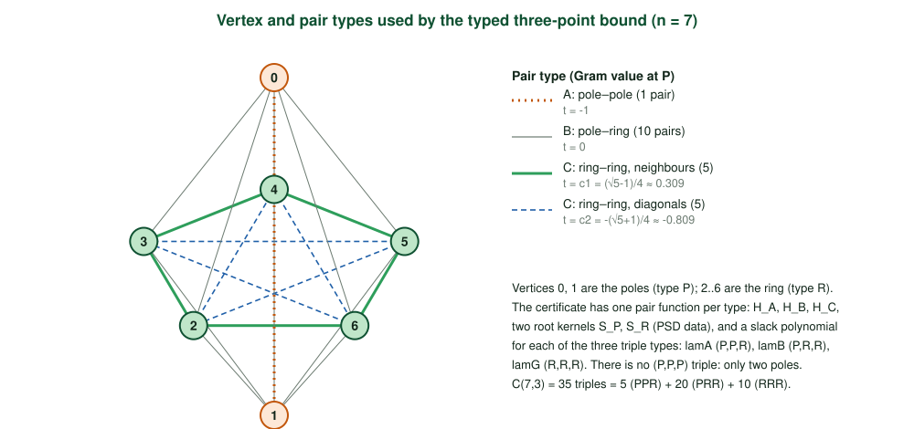

# The pentagonal bipyramid is the unique minimiser of the Coulomb energy of seven points on the sphere

*A three-point semidefinite proof with exact certificates, formalised in Lean 4*

> **About this document.**
>
> * **Claim.** For seven distinct points on the unit sphere $S^2\subset\mathbb R^3$, the Coulomb energy $\sum_{i<j}\|x_i-x_j\|^{-1}$ is at least $E(P)=14.4529774142\ldots$, the energy of the regular pentagonal bipyramid $P$, and equality holds only for images of $P$ under an orthogonal map and a relabelling. This is the Thomson problem for $N=7$.
> * **Origin.** The mathematics and the Lean proof were produced by ten Claude Sonnet 5.5 agents working together for about 15 hours in September 2026. This paper describes the proof step by step, following the Lean file.
> * **Checks.** One Lean 4 file, `Solution.lean` (17,895 lines, imports Mathlib only), builds with `lake build`, is accepted by the Lean Comparator against the fixed `Challenge.lean`, and both theorems depend only on `propext`, `Classical.choice`, `Quot.sound`. A second kernel implementation (nanoda) also accepts the exported proof.
>
> In this repository the two files are `formal/lean/ThomsonN7/Solution.lean` and `formal/lean/ComparatorChallenges/ThomsonN7.lean`; the paper calls them `Solution.lean` and `Challenge.lean`. Line references such as `Solution.lean:12804` refer to the solution file with sha256 `6545e982abaeb4cae0a906c74ca51cc502621aa2a05783bb8da35d96493cc9ce`.

## Abstract

We prove that among all configurations of seven distinct points on $S^2$, the Coulomb energy $E(x)=\sum_{i<j}\|x_i-x_j\|^{-1}$ is minimised exactly by the regular pentagonal bipyramid, with minimum
$$E(P)=\tfrac12+5\sqrt2+\frac{5}{2\sin(\pi/5)}+\frac{5}{2\sin(2\pi/5)}=14.45297741422134\ldots,$$
and that every minimiser is the image of $P$ under an isometry of $\mathbb R^3$ and a relabelling of the points. The proof is computer-assisted and splits on the smallest inner product $m=\min_{i<j}\langle x_i,x_j\rangle$. If $m\ge-9/10$, a degree-5 three-point (Bachoc–Vallentin type) semidefinite bound together with a polynomial minorant of $t\mapsto(2-2t)^{-1/2}$ gives $E\ge E(P)+3.2\times10^{-4}$. If $m<-9/10$, a *typed* three-point bound, which uses different positive semidefinite matrices for the two vertex orbits of $P$ (the poles and the ring), gives $E\ge E(P)+2.6\times10^{-6}$ on five slabs of the smallest inner product covering $[-0.99,-0.9]$. On the last cell $m\le-0.99$, which contains $P$ itself, the same bound holds only up to $2.3\times10^{-16}$ below $E(P)$; that near-sharpness confines any competitor to a tube of width $1/165000$ around the Gram pattern of $P$, where an exact second-order analysis shows $P$ is a strict local minimiser. Every certificate is an exact integer or rational identity, checked inside the Lean kernel. The whole argument is formalised in one 17,895-line Lean 4 file over Mathlib.

## 1. Introduction

The Thomson problem [T1904] asks for the minimum of $\sum_{i<j}\|x_i-x_j\|^{-1}$ over $N$ points on $S^2$. Proofs of global optimality are rare. The cases $N\le4$, $N=6$ and $N=12$ follow for all completely monotone potentials from the universal-optimality theory of Cohn–Kumar [CK07] and earlier work; $N=5$ was settled by a computer-assisted argument of Schwartz [S13]. For $N=8$, proofs appeared in September 2026: a computer-assisted proof verified in Lean by Kryvonos, Liehr and Taylor [KLT26], and a Lean development by Tooby-Smith and Zughaid [TZ26] built on linear-programming and three-point semidefinite bounds. The proof here adapts that approach to $N=7$.

The three-point method of Bachoc–Vallentin [BV08], adapted to energy minimisation by Cohn–Woo [CW12], is a natural route. In the search that produced this proof, a single unrooted three-point certificate left a gap of about $10^{-3}$ at $N=7$. The proof here therefore combines four ingredients:

1. a case split at $m=-9/10$, so that the sharpness problem is confined to configurations containing a near-antipodal pair (which $P$ does: its two poles);
2. an untyped three-point certificate with a cut (Case 1, §5);
3. a *typed* three-point certificate whose matrices depend on the type of the root vertex, and whose slack is distributed among triples by type (Case 2, §6);
4. near the bipyramid, a stability argument: near-equality in the typed bound forces the Gram matrix into a tube around that of $P$, a combinatorial rigidity lemma identifies the labelling, and an explicit local-minimality theorem finishes and gives uniqueness (§7).

All positivity claims reduce to exact identities between polynomials with integer coefficients and to positive semidefiniteness of integer-data matrices; both are checked inside the Lean kernel (§8), so the correctness of the numerical search that produced the certificates is irrelevant.

## 2. The statement

The statements are in `Challenge.lean`; `Solution.lean` reproduces its first 310 lines byte for byte and ends with the two theorems (`diff` of lines 1–310 in `formal/lean/scripts/check.sh`, step 2).

```lean
abbrev R3 := EuclideanSpace ℝ (Fin 3)

def SphereConfig (n : ℕ) : Set (Fin n → R3) :=
  {x | (∀ i, ‖x i‖ = 1) ∧ Function.Injective x}

noncomputable def coulombEnergy {n : ℕ} (x : Fin n → R3) : ℝ :=
  ∑ i : Fin n, ∑ j ∈ Finset.Ioi i, ‖x i - x j‖⁻¹

noncomputable def pentBipyramid : Fin 7 → R3 := fun i =>
  if (i : ℕ) < 5 then cyl 1 (2 * π * (i : ℕ) / 5) 0     -- ring, indices 0..4
  else if (i : ℕ) = 5 then cyl 0 0 1                     -- north pole
  else cyl 0 0 (-1)                                      -- south pole

theorem thomson_seven :
    ∀ x ∈ SphereConfig 7, coulombEnergy pentBipyramid ≤ coulombEnergy x

theorem thomson_seven_unique :
    ∀ x ∈ SphereConfig 7, coulombEnergy x = coulombEnergy pentBipyramid →
      ∃ (g : R3 ≃ₗᵢ[ℝ] R3) (σ : Equiv.Perm (Fin 7)), ∀ i, x i = g (pentBipyramid (σ i))
```

(`Challenge.lean:21–40` and `:313–324`; `cyl ρ θ h = !₂[ρ cos θ, ρ sin θ, h]`.) Three design points matter for reading them.

* **Injectivity is deliberate.** In Lean, $0^{-1}=0$, so without `Function.Injective x` two coincident points would contribute zero energy and the minimum would be wrong.
* **Uniqueness is up to $O(3)$, reflections included, and relabelling.** `g : R3 ≃ₗᵢ[ℝ] R3` is any linear isometry.
* **Sums over $i<j$** use `Finset.Ioi i` in `Fin n`; each unordered pair is counted once.

**The statement.** The Comparator checks that `Solution.lean` proves statements identical to `Challenge.lean`'s; `formal/lean/scripts/compare_statements.py` additionally compares the type (and, for definitions, the value) of 56 of the 57 constants of `Challenge.lean` (all but the separate stretch target `thomson_nine`). The statement itself is the five definitions above (`R3`, `SphereConfig`, `coulombEnergy`, `cyl`, `pentBipyramid`; l.21–40, 20 lines counting docstrings and blank lines) and the two theorem statements (l.313–324, 12 lines), 32 lines in all. The two statements mention no other definition of `Challenge.lean` (only these five and Mathlib's own notions); the other lines of the first 310 are proved helper lemmas, checked by the kernel.

**Numerical facts about $P$** (computed in `paper/numerics/paper_numerics.log`). With $t_{ij}=\langle P_i,P_j\rangle$ the 21 Gram values are
$$-1\ (\times1),\qquad 0\ (\times10),\qquad c_1=\tfrac{\sqrt5-1}{4}\ (\times5),\qquad c_2=-\tfrac{1+\sqrt5}{4}\ (\times5),$$
namely the poles (distance 2), the ten pole–ring pairs (distance $\sqrt2$), the five ring neighbours (distance $2\sin\frac\pi5$) and the five ring diagonals (distance $2\sin\frac{2\pi}5$). The closed form above and the direct sum agree to $4\times10^{-40}$; $E(P)=14.4529774142213429350444915306\ldots$.

## 3. Overview of the proof

Write $\varphi(t)=(2-2t)^{-1/2}$, so that for unit vectors $\|x-y\|^{-1}=\varphi(\langle x,y\rangle)$ (`phi`, `Solution.lean:318`) and $E(x)=\sum_{i<j}\varphi(t_{ij})$ with $t_{ij}=\langle x_i,x_j\rangle$. Let $m=\min_{i<j}t_{ij}$.


* **Case 1: $m\ge-9/10$.** An untyped three-point certificate proves $E(x)\ge E(P)+3.2\times10^{-4}$ (§5, `Case1` namespace, `Solution.lean:10273–10584`). In particular equality never occurs.
* **Case 2: $m<-9/10$.** After relabelling, the pair $(0,1)$ attains the minimum (`exists_minpair_perm`, l.12058; `RootedClaim`, l.12072; the reduction `case2_of_rooted`, l.12077). The value $a=\langle x_0,x_1\rangle$ is covered by breakpoints (`Final.a`, l.17850)
$$-1\ \le\ a_0=-\tfrac{99}{100}<a_1=-\tfrac{49}{50}<a_2=-\tfrac{24}{25}<a_3=-\tfrac{47}{50}<a_4=-\tfrac{93}{100}<a_5=-\tfrac9{10},$$
a **cap** $a\le a_0$ and five **slabs** $[a_k,a_{k+1}]$ (`Glue.seven_of_specs`, l.12804, which needs only `hK : -9/10 ≤ a K`, a `CapSpec (a 0)` and a `SlabSpec (a k) (a (k+1))` for each $k<5$; the covering lemma is `exists_cell`, l.12097).
  * On a slab, the typed bound gives $E(x)\ge E(P)+2.5857787\times10^{-6}$ (§6).
  * On the cap the typed bound is only $E\ge E(P)-2.27\times10^{-16}$, and one argues by stability (§7).

The final theorems are five lines, `Solution.lean:17884–17895`:
`thomson_seven := (Glue.seven_of_specs Final.a Final.K Final.hK Final.hcap Final.hslab).1`, and `.2` for uniqueness.

## 4. Three-point positivity on $S^2$

This is the only place where the geometry of the sphere enters the certificates. It is a classical statement (Bachoc–Vallentin [BV08]); we give the short proof, following the Lean lemma `Q3_eq_re` (l.557), because every later step is built from it.

**Kernels.** For $k\ge0$ define polynomials in $(u,v,t)$ by
$$Q_0=1,\qquad Q_1=t-uv,\qquad Q_{k+2}=2(t-uv)\,Q_{k+1}-(1-u^2)(1-v^2)\,Q_k$$
(`Q3`, l.527). For $m\ge1$ let $Y_k(u,v,t)$ be the $m\times m$ matrix with entries $u^{a}v^{b}Q_k(u,v,t)$, $0\le a,b<m$ (`Y3`, l.534), and $S_k$ the average of $Y_k$ over the six permutations of $(u,v,t)$ (`S3`, l.538).

**Lemma 4.1 (positivity).** Let $x_1,\dots,x_n$ be unit vectors in $\mathbb R^3$ (not necessarily distinct), $t_{ij}=\langle x_i,x_j\rangle$ (so $t_{ii}=1$), and let $F$ be a real symmetric positive semidefinite $m\times m$ matrix. Then for every $k\ge0$
$$\sum_{i,j,l=1}^{n}\big\langle F,\;Y_k(t_{ij},\,t_{il},\,t_{jl})\big\rangle\ \ge\ 0 ,$$
where $\langle A,B\rangle=\sum_{ab}A_{ab}B_{ab}$. Moreover, for a fixed root $i$ the inner sum over $(j,l)$ is already $\ge0$.

*Proof.* Fix the root $i$. For each $j$ put $u_j=\langle x_i,x_j\rangle$ and $w_j=x_j-u_jx_i\perp x_i$, so $\|w_j\|^2=1-u_j^2$. Identify the plane $x_i^\perp$ isometrically with $\mathbb C$ and let $z_j\in\mathbb C$ be the image of $w_j$ (with $z_i=0$). Then $|z_j|^2=1-u_j^2$ and $\langle w_j,w_l\rangle=\mathrm{Re}(z_j\bar z_l)$, while $\langle x_j,x_l\rangle=u_ju_l+\langle w_j,w_l\rangle$. Hence
$$t_{jl}-u_ju_l=\mathrm{Re}(z_j\bar z_l).$$
*Claim:* $Q_k(u_j,u_l,t_{jl})=\mathrm{Re}\big((z_j\bar z_l)^k\big)$. For $k=0,1$ this is the display above. Put $\omega=z_j\bar z_l$; then $\omega^2=2\,\mathrm{Re}(\omega)\,\omega-|\omega|^2$ and $|\omega|^2=(1-u_j^2)(1-u_l^2)$, so $\mathrm{Re}\,\omega^{k+2}=2\,\mathrm{Re}(\omega)\,\mathrm{Re}\,\omega^{k+1}-|\omega|^2\,\mathrm{Re}\,\omega^{k}$, which is the recursion. This is `Q3_eq_re`.

Since $\mathrm{Re}(z_j^k\overline{z_l^{\,k}})=\mathrm{Re}\,z_j^k\,\mathrm{Re}\,z_l^k+\mathrm{Im}\,z_j^k\,\mathrm{Im}\,z_l^k$,
$$\sum_{j,l}\langle F,Y_k\rangle=\sum_{a,b}F_{ab}\Big[\rho_a\rho_b+\iota_a\iota_b\Big]=\rho^{\!\top}F\rho+\iota^{\!\top}F\iota\ \ge0,$$
with $\rho_a=\sum_ju_j^a\,\mathrm{Re}\,z_j^k$ and $\iota_a=\sum_ju_j^a\,\mathrm{Im}\,z_j^k$. Summing over the root $i$ proves the lemma. $\square$

**Symmetrisation costs nothing.** A permutation of the arguments $(t_{ij},t_{il},t_{jl})$ is the same triple seen from a different root, in a different order, so summing over all ordered triples $(i,j,l)$ gives the same total for $S_k$ as for $Y_k$. When $F$ is symmetric, swapping the two non-root vertices replaces $Y_k$ by its transpose, which has the same pairing with $F$; this is the origin of the factors $2$ in §6.

**Boundary values.** $Q_k(1,1,1)=\delta_{k0}$ (because $1-u^2=0$ and $t-uv=0$ there), so $\langle F,Y_k(1,1,1)\rangle$ equals the sum of all entries of $F$ for $k=0$ and vanishes for $k\ge1$. Also $Q_k(u,u,1)=(1-u^2)^k$.

A triple of unit vectors has Gram matrix $\left(\begin{smallmatrix}1&u&v\\u&1&t\\v&t&1\end{smallmatrix}\right)\succeq0$, i.e. `GramOK u v t` (l.1048): $u^2,v^2,t^2\le1$ and $1+2uvt-u^2-v^2-t^2\ge0$. That is the only constraint the certificates use besides the cut $t\ge a$.

## 5. Case 1: all inner products at least $-9/10$

### 5.1 From positivity to an energy bound

Let $s(u,v,t)=\sum_{k<K}\langle F_k,S_k(u,v,t)\rangle$ with $F_k\succeq0$ of size $m_k=6-k$ ($K=4$, blocks of sizes $6,5,4,3$; `Case1Data.F0…F3`). Lemma 4.1 and symmetrisation give
$$\Sigma_{\rm all}:=\sum_{i,j,l\in[n]}s(t_{ij},t_{il},t_{jl})\ \ge 0.\tag{1}$$
Split the index triples into the ordered *distinct* triples, the triples with exactly two equal indices and the triples with all three equal. With $\mathrm{dsum}(f)=\sum_{(i,j,l)\ \text{distinct}}f(t_{ij},t_{il},t_{jl})$ (`dsum`, l.737),
$$\Sigma_{\rm all}=\mathrm{dsum}(s)+3\sum_{i\ne j}s(t_{ij},t_{ij},1)+n\,s(1,1,1).$$
Define
$$R_s(u,v,t)=(n-2)\,s(u,v,t)+s(u,u,1)+s(v,v,1)+s(t,t,1)+\frac{s(1,1,1)}{n-1}\qquad(\texttt{Rs},\ \text{l.934}).$$
Counting how often each pair and each index occurs among ordered distinct triples ($n-2$ times for a pair, $n(n-1)(n-2)$ triples in all) gives $\mathrm{dsum}(R_s)=(n-2)\,\Sigma_{\rm all}$.

Now let $H$ be a function and $e$ a constant, and define the **slack**
$$\mathrm{slack}(u,v,t)=\frac{H(u)+H(v)+H(t)}3-\frac{e}{\binom n2}-R_s(u,v,t).$$
Summing over ordered distinct triples ($\,\mathrm{dsum}$ of the first term is $2(n-2)\sum_{i<j}H(t_{ij})$, of the second $2(n-2)e$) yields the identity (`three_point_identity`, l.1097)
$$\mathrm{dsum}(\mathrm{slack})+(n-2)\,\Sigma_{\rm all}=2(n-2)\Big(\sum_{i<j}H(t_{ij})-e\Big).\tag{2}$$
**Consequence** (`three_point_bound_cut`, l.5942). If $\mathrm{slack}\ge0$ at every Gram triple with entries $\ge a$, then by (1) and (2), for every configuration with all $t_{ij}\ge a$,
$$\sum_{i<j}H(t_{ij})\ \ge\ e.$$
If moreover $H\le\varphi$ on $[a,1)$, then $E(x)\ge e$ (`margin_of_threePoint_cut`, l.5991, gives $E(P)+\eta\le E(x)$ when $e\ge E(P)+\eta$).

So Case 1 needs three things: PSD matrices $F_k$, a polynomial $H\le\varphi$, and a proof that the slack is nonnegative on a semialgebraic set. Nothing else about $n=7$ enters except the numbers $n=7$, $\binom72=21$.

### 5.2 The certificate

The data are integers over a common denominator $\Lambda=2^{160}$ (`Case1Data.cf`, `Cert3`, l.2640; the data are at l.9591–10264):

| item | value |
|---|---|
| $n$, cut $a$ | $7$, $a=-9/10$ (`an/ad = -9/10`) |
| $H$ | $H(t)=\sum_{j=0}^{10}h_jt^j/\Lambda$, $h_j\in\mathbb Z$ (11 coefficients) |
| $e$ | $e=\texttt{eps}/\Lambda$ with $\texttt{eps}=21123521614834739147673317992698253367993089823382$ |
| $F_0,\dots,F_3$ | PSD blocks of sizes $6,5,4,3$ |
| SOS blocks $S_0,\dots,S_7$ | Gram matrices of size $56;35,35,35;35,35,35;20$ |

The eight SOS blocks belong to the multipliers $1$; $u+\frac9{10}$, $v+\frac9{10}$, $t+\frac9{10}$ (the cut); $1-u$, $1-v$, $1-t$; and the Gram determinant $\det G=1+2uvt-u^2-v^2-t^2$. The certificate asserts the polynomial identity
$$\mathrm{slack}(u,v,t)\;=\;\frac1\Lambda\sum_{r=0}^{7}g_r(u,v,t)\;z_r^{\!\top}B_r\,z_r ,\tag{3}$$
with $g_r$ the multipliers above, $z_r$ the vector of monomials of degree $\le5$ (block $S_0$), $\le4$ ($S_1,\dots,S_6$) or $\le3$ ($S_7$), and $B_r\succeq0$. The Lean form clears denominators: `Cert3.idE` (l.2670) is
$$2(n-1)\tbinom n2\,h_E-6(n-1)\,\texttt{eps}-\tbinom n2\,F_{\rm tot}-6(n-1)\tbinom n2\sum_rg_r\,z_r^{\!\top}B_rz_r\ \equiv\ 0,$$
with $h_E=\sum_jh_j(u^j+v^j+t^j)$ and $F_{\rm tot}$ the integer polynomial $\sum_k\langle F_k,\cdot\rangle$ assembled from the kernels. (3) makes the slack nonnegative wherever all $g_r\ge0$, i.e. on Gram triples with entries in $[-\frac9{10},1]$; this is `hpt_gramCut` (l.2751) and `Cert3.sound` (l.2804).

**The margin.** $e=\texttt{eps}/\Lambda=14.4533\ldots$ and, with $E(P)$ from §2,
$$e-E(P)=3.225858\times10^{-4}\ \ge\ 3\times10^{-4}.$$
(Recomputed from the integers in the Lean source with 60-digit arithmetic.)

### 5.3 The one-dimensional minorant

It remains to show $H\le\varphi$ on $[-\frac9{10},1)$. Substitute $y=\frac12\sqrt{2-2t}\in(0,\sqrt{19/20}\,]$, so $t=1-2y^2$ and $\varphi=\frac1{2y}$. With $H=Q/\Lambda$, the inequality $H\le\varphi$ is
$$\Lambda-2y\,Q(1-2y^2)\ \ge\ 0\qquad\text{for }0<y,\ \ 20y^2\le19$$
(the cut $t\ge-\frac9{10}$ is $20y^2\le19$). The Lean certificate (`Cert`, `cutCert`, l.9285) is
$$\Lambda-2yQ(1-2y^2)=A_0(y)+y\,A_1(y)+(19-20y^2)A_2(y)+y\,(19-20y^2)A_3(y),\tag{4}$$
where each $A_i$ is a weighted sum of squares $\sum_qd_q\rho_q(y)^2$ with $d_q\in\mathbb N$ and $\rho_q$ integer polynomials; this is the Lukács representation of a polynomial that is nonnegative on an interval, checked as an exact polynomial identity (§8). Each term is $\ge0$ on the interval, so the left side is.


### 5.4 Result

`Case1.seven_of_case2` (l.10563) assembles: if all $t_{ij}\ge-\frac9{10}$ then $E(x)\ge E(P)+\frac3{10^4}$; the remaining configurations are Case 2.

## 6. Case 2: the typed three-point bound

If $m<-\frac9{10}$, the relabelled configuration has a near-antipodal pair $(0,1)$ that minimises all inner products. The bipyramid has such a pair (its poles, $t=-1$), so here the bound must be sharp at $P$ in the limit. A single symmetric certificate treats all 7 vertices alike; $P$ has two vertex orbits.

### 6.1 Types

Label the points $0,1$ (*poles*, type P) and $2,\dots,6$ (*ring*, type R); this labelling is the one the minimal pair produces and is *not* the index convention of `pentBipyramid` in §2 (there the ring is $0..4$). Pairs are of three classes:

* A: the pole–pole pair (1), B: pole–ring pairs (10), C: ring–ring pairs (10);
* triples: PPR (5), PRR (20), RRR (10): $35=\binom73$ unordered, $210=7\cdot6\cdot5$ ordered.



We use three class minorants $H_A,H_B,H_C\le\varphi$ (each a degree-10 polynomial over $\Lambda$), so that $E(x)\ge\sum_{i<j}H_{\mathrm{cls}(i,j)}(t_{ij})$ (`cls3`, l.12135), and two families of PSD matrices $F_P^{(k)},F_R^{(k)}$ ($k=0,\dots,5$, size $6-k$), giving two forms
$$s_P=\sum_k\langle F_P^{(k)},Y_k\rangle,\qquad s_R=\sum_k\langle F_R^{(k)},Y_k\rangle .$$
Lemma 4.1 is applied at each root $i$ with $F_{\mathrm{type}(i)}$, and the results are added:
$$\Sigma_{\rm all}:=\sum_{i,j,l\in[7]}s_{\mathrm{type}(i)}(t_{ij},t_{il},t_{jl})\ \ge0.\tag{5}$$

### 6.2 Shares and slacks

Write $\mathrm{gm}_X(t)=s_X(1,t,t)+s_X(t,1,t)+s_X(t,t,1)$ (the triples with a repeated index) and
$$\Psi_A=H_A-2\,\mathrm{gm}_P,\qquad \Psi_B=H_B-\mathrm{gm}_P-\mathrm{gm}_R,\qquad\Psi_C=H_C-2\,\mathrm{gm}_R .$$
So $\Psi_{\rm cls(i,j)}(t_{ij})=H(t_{ij})-\mathrm{gm}_{\mathrm{type}(i)}(t_{ij})-\mathrm{gm}_{\mathrm{type}(j)}(t_{ij})$. The idea is to give each pair $\{i,j\}$ a **share** $W(\{i,j\}\mid l)$ at every third vertex $l$ so that the shares of a pair add up to $\Psi$ of that pair, and then to require, triple by triple, that the shares plus a constant beat the kernel terms. The shares used (`W7`, l.11016; $\psi_{Ba},\psi_{Cb}$ are two more degree-10 polynomials, free parameters of the certificate):

| pair | third vertex | share |
|---|---|---|
| pole–pole (A) | each of the 5 ring vertices | $\Psi_A(t)/5$ |
| pole–ring (B) | the other pole | $\psi_{Ba}(t)$ |
| pole–ring (B) | each of the 4 other ring vertices | $(\Psi_B-\psi_{Ba})(t)/4$ |
| ring–ring (C) | each of the 2 poles | $\psi_{Cb}(t)$ |
| ring–ring (C) | each of the 3 other ring vertices | $(\Psi_C-2\psi_{Cb})(t)/3$ |

Each row group sums to $\Psi$ of its class. For an unordered triple $T$ the **slack** is (sum of the three shares in $T$) $-$ (a constant $c_T$) $-$ $2\times$ (sum over the three roots of the kernel form at that root). The factor 2 is the swap of the two non-root vertices (§4). With $u,v,t$ the three inner products of the triple, in the order shown:

* PPR, $\{0,1,r\}$ with $u=t_{01},v=t_{0r},t=t_{1r}$:
$$\lambda_A=\tfrac{\Psi_A(u)}5+\psi_{Ba}(v)+\psi_{Ba}(t)-c_{\alpha}-2\big(s_P(u,v,t)+s_P(u,t,v)+s_R(v,t,u)\big);$$
* PRR, $\{p,r,r'\}$ with $u=t_{pr},v=t_{pr'},t=t_{rr'}$:
$$\lambda_B=\tfrac{(\Psi_B-\psi_{Ba})(u)}4+\tfrac{(\Psi_B-\psi_{Ba})(v)}4+\psi_{Cb}(t)-c_{\beta}-2\big(s_P(u,v,t)+s_R(u,t,v)+s_R(v,t,u)\big);$$
* RRR, with $u,v,t$ the three ring–ring inner products:
$$\lambda_\Gamma=\sum_{x\in\{u,v,t\}}\tfrac{(\Psi_C-2\psi_{Cb})(x)}3-c_{\gamma}-2\big(s_R(u,v,t)+s_R(u,t,v)+s_R(v,t,u)\big).$$

(`lamA`, `lamB`, `lamG`, l.11056–11065.) The constants are $c_\alpha$ (PPR), $c_\beta$ (PRR) and $c_\gamma$, with $c_\gamma$ determined by the requirement
$$5c_\alpha+20c_\beta+10c_\gamma\;=\;e+2s_P(1,1,1)+5s_R(1,1,1)\tag{6}$$
(`hc7`, l.11050; $s_X(1,1,1)$ is the sum of the entries of $F_X^{(0)}$ by §4).

### 6.3 Why the slacks give the bound

Suppose $\lambda_A,\lambda_B,\lambda_\Gamma\ge0$ at every Gram triple that can occur. Add $\lambda_T$ over all $35$ unordered triples $T$.

* The shares: each pair $\{i,j\}$ contributes its shares at all $5$ possible third vertices, which sum to $\Psi(t_{ij})$; so the shares total $\sum_{i<j}\Psi(t_{ij})$.
* The constants: $\sum_Tc_T=5c_\alpha+20c_\beta+10c_\gamma=e+\sum_is_{{\rm type}(i)}(1,1,1)$ by (6).
* The kernel terms: each ordered distinct triple $(i,j,l)$ is one of the $6$ orderings of an unordered $T$; the three roots and the swap give $2\sum_{\rm roots}$, so the kernel terms total $D:=\sum_{(i,j,l)\ \text{distinct}}s_{{\rm type}(i)}(t_{ij},t_{il},t_{jl})$.

Hence
$$0\le\sum_T\lambda_T=\sum_{i<j}\Psi(t_{ij})-e-\sum_is_{{\rm type}(i)}(1,1,1)-D .$$
On the other hand (5) splits, exactly as in §5.1, into $D+\sum_{i\ne j}\mathrm{gm}_{{\rm type}(i)}(t_{ij})+\sum_is_{{\rm type}(i)}(1,1,1)\ge0$, and $\sum_{i\ne j}\mathrm{gm}_{{\rm type}(i)}(t_{ij})=\sum_{i<j}\big(\mathrm{gm}_{{\rm type}(i)}+\mathrm{gm}_{{\rm type}(j)}\big)(t_{ij})$. Adding the two inequalities, the marginals and the boundary terms cancel exactly, leaving
$$\sum_{i<j}H_{{\rm cls}(i,j)}(t_{ij})\ \ge\ e.$$
This is `typed_bound_comb2` (l.10904, derivation checked by hand) with the reduction `hpt7` (l.11098).

### 6.4 Ranges and the minimal pair

The slacks need only be nonnegative on the triples that occur. In the rooted configuration the pair $(0,1)$ is minimal, so every inner product is $\ge t_{01}\ge a_k$ on a slab, and $t_{01}\le a_{k+1}$: $\lambda_A\ge0$ is required for Gram triples with $a_k\le u\le a_{k+1}$ and $v,t\ge a_k$, while $\lambda_B,\lambda_\Gamma\ge0$ are required for Gram triples with all entries $\ge a_k$. The extra constraints ($u\ge a_k$, $u\le a_{k+1}$, entries $\ge a_k$) are what make the certificates feasible; they appear as extra multipliers next to the Gram determinant.

### 6.5 The certificates

Each cell has one `TCert` (l.14839): $\Lambda$, the band, integers $e,c_\alpha,c_\beta$, degree-10 polynomials $H_A,H_B,H_C,\psi_{Ba},\psi_{Cb}$, the twelve PSD blocks $F_P^{(0..5)},F_R^{(0..5)}$, integer scalings $m_A,m_B,m_G$ and three lists of SOS blocks with their multipliers. The Lean check is: all blocks PSD, and three exact identities which, schematically, read $m_A\Lambda\lambda_A=\sum_r g_r\,z_r^\top B_rz_r$, and likewise for $\lambda_B,\lambda_\Gamma$ with $m_B,m_G$ (`idA`, `idB`, `idG`, l.14895–14901; the multipliers $g_r$ are the cut and band conditions of §6.4, and `idB`, `idG` use the lower cut only, with `bn = bd = 1`). The parameters and the margin $e-E(P)$, both read from the Lean integers and recomputed by me, are:

| cell | range of $t_{01}$ | $\Lambda$ | $(m_A,m_B,m_G)$ | SOS blocks (A/B/G) | $e-E(P)$ |
|---|---|---|---|---|---|
| cap `tc_cap` (l.16055) | $[-1,-\frac{99}{100}]$ | $2^{136}$ | $(2,2,2)$ | 7/5/5 | $-2.2737\times10^{-16}$ |
| slab 1 `s99_98` | $[-\frac{99}{100},-\frac{49}{50}]$ | $2^{100}$ | $(5000,100,100)$ | 6/5/5 | $+2.5858\times10^{-6}$ |
| slab 2 `s98_96` | $[-\frac{49}{50},-\frac{24}{25}]$ | $2^{100}$ | $(1250,50,50)$ | 6/5/5 | $+2.5858\times10^{-6}$ |
| slab 3 `s96_94` | $[-\frac{24}{25},-\frac{47}{50}]$ | $2^{100}$ | $(1250,25,25)$ | 6/5/5 | $+2.5858\times10^{-6}$ |
| slab 4 `s94_93` | $[-\frac{47}{50},-\frac{93}{100}]$ | $2^{100}$ | $(5000,50,50)$ | 6/5/5 | $+2.5858\times10^{-6}$ |
| slab 5 `s93_90` | $[-\frac{93}{100},-\frac9{10}]$ | $2^{100}$ | $(1000,100,100)$ | 6/5/5 | $+2.5858\times10^{-6}$ |

All five slabs use the same value $e=14.45298$ (to 25 digits), so the margin is $e-E(P)=2.5857787\times10^{-6}$. The cap's $e$ is $1259031901072922459286254611941137639131858/2^{136}$.

## 7. Case 2, continued: the slabs and the cap

### 7.1 Slabs

`SlabSpec lo hi` (l.12739) says: there are $e>E(P)$ and minorants $H_A\le\varphi$ on $[lo,hi]$, $H_B,H_C\le\varphi$ on $[lo,1)$ such that every minimal-pair configuration with $lo\le t_{01}\le hi$ satisfies $e\le\sum_{i<j}H_{\rm cls}(t_{ij})$. §6 proves the last clause from the certificate; the minorant clauses are 1-D certificates in the form (4), with two-sided interval multipliers $y$, $\mu_2-\nu_2y^2$, $\nu_1y^2-\mu_1$ (`SlabOneD`, `Par`, l.15211). Then $E(x)\ge e>E(P)$: strict inequality, so uniqueness is vacuous here (`slabSpec_sound`, l.12750).

### 7.2 The cap

`CapSpec a0` (l.12717) is the near-sharp statement. It provides $e,\delta,\tau$ and $H_A,H_B,H_C$ with

* $\tau\le\frac1{165000}$ and $E(P)\le e+\delta$ ($\delta=511168595372501\times10^{-30}\approx5.1\times10^{-16}$, above $E(P)-e=2.27\times10^{-16}$);
* the typed bound $e\le\sum H_{\rm cls}(t_{ij})$ for minimal-pair configurations with $t_{01}\le a_0$;
* class minorants $H_X\le\varphi$ together with *coercivity*: $\varphi-H_A\le\delta\Rightarrow\lvert t+1\rvert\le\tau$ on $[-1,a_0]$; $\varphi-H_B\le\delta\Rightarrow\lvert t\rvert\le\tau$; $\varphi-H_C\le\delta\Rightarrow\lvert t-c_1\rvert\le\tau$ or $\lvert t-c_2\rvert\le\tau$.

*Proof that a cap configuration $y$ has $E(y)\ge E(P)$, with equality only on the orbit of $P$* (`capSpec_sound`, l.12729; `cap_of_typed_tube`, l.12394):

1. Suppose $E(y)\le E(P)$. Then $\sum_{i<j}(\varphi-H_{\rm cls})(t_{ij})=E(y)-\sum H\le E(P)-e\le\delta$. Each term is $\ge0$, so each is $\le\delta$.
2. By coercivity, $t_{01}$ is within $\tau$ of $-1$, all ten pole–ring inner products are within $\tau$ of $0$, and each of the ten ring–ring inner products is within $\tau$ of $c_1$ or of $c_2$.
3. **The ring is a pentagon** (`ring_pentagon`, l.11887; `ring_rigid`, l.11950, for $\tau\le\frac1{10}$). Colour each edge of the complete graph on the five ring vertices by which of $c_1,c_2$ it is near. No triangle can be monochromatic. Four unit vectors in $\mathbb R^3$ (a pole and three ring points) have a singular $4\times4$ Gram matrix; the Lean proof shows, by interval bisection over the allowed box of Gram entries (`chk4`, l.11547; `no_mono_cosB`, l.11687; `no_mono_cosA`, l.11709), that on that box either the $4\times4$ determinant has no zero or some $3\times3$ minor is negative, so a monochromatic triangle is impossible. A triangle-free 2-colouring of $K_5$ has both colour classes equal to a 5-cycle (a pentagon and a pentagram); `comb5_dec` (l.11755) proves this by exhaustive `decide` over $2^{10}$ colourings. So the Gram matrix of $y$ is within $\tau$, entry by entry, of that of a relabelled $P$ (`TubeRigid`, l.12329).
4. **A Gram window forces coordinates**: `localGram_of_localMinAt` (l.5814) says that local minimality of the energy in coordinate radius $\frac{11}2w$ implies local minimality on the Gram window $w$ (for $w\le\frac1{10}$); with $w=\frac1{165000}$ the coordinate radius is $\frac1{30000}$.
5. **Local minimality** (`pent_local_min_sup`, l.9098, from `pent_local_min`, l.9059): every unit injective configuration with $\|z_i-P_i\|\le\frac1{30000}$ for all $i$ has $E(z)\ge E(P)$, with equality only if $z=g\circ P$ for an isometry $g$. Its core is `local_ineq` (l.9020): after gauge fixing (Procrustes alignment, `exists_gauge`, l.4838) and within $10^{-4}$, $E(y)-E(P)\ge10^{-3}\sum_i\|y_i-P_i\|^2$, from an explicit second-order expansion of $E$ with a rigorously bounded cubic remainder (`energy_ge_cubic`, l.6703).

Steps 1–5 give $E(y)\ge E(P)$ in all cases (if $E(y)>E(P)$ there is nothing to prove) and the equality clause. The whole cap therefore rests on the certificate being *exactly* correct to $10^{-16}$, which is why $E(P)$ is enclosed to 40 digits in the Lean file (`coulombEnergy_pent_le_of`, l.12889) and why all arithmetic there is in exact integers and rationals.

**Combining.** `seven_of_cap_slabs` (l.12282) and `seven_of_specs` (l.12804) glue the cap, the five slabs and Case 1 into the two theorems.

## 8. Exact certificates and how the Lean kernel checks them

Nothing about the certificates is trusted; they are data, and Lean proves the following.

**(a) Positive semidefinite blocks.** A block is stored as pivots $d_q\ge0$, columns $l_q$ and a remainder $\Delta$ with $M=\sum_qd_q\,l_ql_q^\top+\Delta$ (`Blk`, l.2160). The check is: $d_q\ge0$, $\Delta$ symmetric, and $\sum_{j\ne i}\lvert\Delta_{ij}\rvert\le\Delta_{ii}$ for each $i$ (diagonal dominance). Then $x^\top Mx\ge0$: the first part is a sum of squares, the second follows from $2\lvert x_ix_j\rvert\le x_i^2+x_j^2$ (`qform_dd_nonneg`, l.2096; `qf_nonneg`, l.2207; `fmat_psd`, l.2397). The data come from rounding numerical SDP solutions; how the numbers were found is not part of the argument.

**(b) Polynomial identities by Kronecker substitution.** The identities (3), (4) and their typed analogues are checked as equalities of integer polynomials in $u,v,t$. A polynomial $p=\sum c_{abd}u^av^bt^d$ with all degrees $<D$ and $\sum|c_{abd}|<2^w$ (in Lean `hl : e.l1 < 2 ^ w`, the $\ell^1$-norm of the uncollected coefficients) is identically zero if and only if $p(2^w,2^{wD},2^{wD^2})=0$: the exponents $w(a+Db+D^2d)$ are distinct, so this is a base-$2^w$ expansion with digits of absolute value $<2^w$, and if the top nonzero digit is $c$ then $\lvert c\rvert\,2^{wk}$ exceeds the sum of all lower terms, at most $(2^w-1)\sum_{j<k}2^{wj}<2^{wk}$. (`Ex.ev_eq_zero_of_kev`, l.1901.) Lean then only evaluates one big integer expression, with $w=179$ and $D=11$ in Case 1; the kernel's built-in big-natural arithmetic does it. The check is written as a Boolean function and closed by `decide +kernel`, after a Lean-proved soundness lemma (`chk_sound`, l.2682; the soundness of the statistics that bound $w$ and $D$ is `c1Stat`, l.10308).

**(c) Where kernel computation is used.** `decide +kernel` occurs in 70 tactic positions: 4 in library code that the two theorems do not depend on, 24 in Case 1, 7 in the cap and 35 in the slabs (66 in the dependency cone). None of `sorry`, `native_decide`, `ofReduceBool`, new axioms, `set_option`, macros or `#eval` occurs (`formal/lean/scripts/check.sh` step 3). The axioms of both theorems are `propext`, `Classical.choice`, `Quot.sound`.

## 9. Verification record

| # | check | result |
|---|---|---|
| 1 | The agents' own checker during the run: `lake build`, the Lean Comparator against `Challenge.lean`, `#print axioms` | 4 cold and 6 cached runs, exit 0; cold build about 18.5 min plus Comparator about 13.5 min, 19–20 GB peak |
| 2 | Rebuild from a pristine clone on an M5 Pro Mac (48 GiB) inside `sandbox-exec` (network denied, writes confined), artifact cache off | scan, `lake build` (8927 jobs), Comparator ("Your solution is okay!"), `#print axioms`: pass; 580.65 s, 13.2 GB |
| 3 | One-command check `formal/check.sh` from a clean copy of this repository, with the negative control for the statement comparison | exit 0: 8928 jobs, build 343.7 s (599 s wall); with a tampered `thomson_seven` statement the comparison flags that constant and no other |
| 4 | **Second kernel**: `lean4export` (commit `076e8e57…`, export format 3.1.0) exports the two theorems' dependency set (7,218,186 lines); `nanoda_lib` 0.4.19 (Rust) checks it | "Checked 47854 declarations with no errors"; axioms exactly `propext`, `Quot.sound`, `Classical.choice`; export sha256 `5a631ea6…`; `formal/lean/scripts/second-kernel.sh` from a clean copy: 233 s |
| 5 | Negative control for 4: one integer of the Case-1 data changed by 1 in the export | nanoda aborts on a definitional-equality assertion without a success line |
| 6 | Lean Comparator by `formal/lean/ComparatorChallenges/run_comparator.sh` from a clean copy (modules `ComparatorChallenges.ThomsonN7` and `ThomsonN7.Solution`) | "Your solution is okay!"; 260 s |

Pins: Lean v4.34.1, Mathlib `d13f23b723b8a846827a245b89c10fc7d3f11612`, Comparator `fd5d5bcf…`, nanoda `3a240721…`, lean4export `076e8e57…`. lean4export has to be built with the Lean that wrote the `.olean` files it reads, so `formal/lean/scripts/tools.sh` sets the `lean-toolchain` of the lean4export checkout to v4.34.1 (the pinned commit says v4.34.0); no source file of any checker is changed. Items 1–3 and 6 use Lean's kernel; items 4–5 use a second kernel implementation. The logs of items 3–6 are in `verification/`.

## 10. Numerical evidence (not part of the proof)

These support the statement; nothing above depends on them.

* **Computation** (`paper/numerics/paper_numerics.py`): the Gram multiset of $P$, $E(P)$ to 40 digits, first-order stationarity (max tangential gradient $8.4\times10^{-17}$), the radial components of the gradient $-2.0835$ (ring, $\times5$) and $-2.0178$ (poles, $\times2$), which sum to $-E(P)$ as Euler's identity requires, and the analytic Hessian on the tangent space: eigenvalues $0,0,0$ (rotations), $0.009198\ (\times2)$, $0.9632,\dots,3.9046$, so $P$ is a strict local minimum modulo rotations with smallest nonzero eigenvalue $0.009198$. (The Lean local analysis uses its own constant $449/100000$ for its own normalisation of the quadratic form, `Solution.lean:9010`;)

## 11. Reproducing

```
bash formal/check.sh                                       # hashes, token scan, claims index, build, axioms, statement comparison, negative control
bash formal/lean/ComparatorChallenges/run_comparator.sh    # Lean Comparator
bash formal/lean/scripts/second-kernel.sh                  # export + nanoda + negative control
python3 paper/numerics/paper_numerics.py                   # numbers of sections 2 and 10 (mpmath, numpy)
```

`formal/check.sh` needs `elan`, about 14 GB RAM and 10–25 minutes. `REPRODUCE.md` has the details.

## References

| key | reference |
|---|---|
| [BV08] | C. Bachoc, F. Vallentin, New upper bounds for kissing numbers from semidefinite programming, J. Amer. Math. Soc. 21 (2008) 909–924 |
| [CK07] | H. Cohn, A. Kumar, Universally optimal distribution of points on spheres, J. Amer. Math. Soc. 20 (2007) 99–148 |
| [CW12] | H. Cohn, J. Woo, Three-point bounds for energy minimization, J. Amer. Math. Soc. 25 (2012) 929–958, arXiv:1103.0485 |
| [KLT26] | Kryvonos, Liehr, Taylor, Energy minimization for eight points on the sphere, arXiv:2609.22077 (18 Sep 2026) |
| [S13] | R. E. Schwartz, The five-electron case of Thomson's problem, Exp. Math. 22 (2013) 157–186 |
| [T1904] | J. J. Thomson, On the structure of the atom, Phil. Mag. 7 (1904) 237–265 |
| [TZ26] | J. Tooby-Smith, A. Zughaid, Thomson-N-8-Warrant, Lean 4 development, https://github.com/jstoobysmith/Thomson-N-8-Warrant (2026) |
| — | Lean 4, Mathlib, Lean Comparator, `lean4export`, `nanoda_lib` at the commits in §9 |

## Appendix A. Index of the Lean file

`Solution.lean`, line numbers as of the sha256 in the header.

| topic | declaration | line |
|---|---|---|
| definitions (as `Challenge.lean`) | `R3`, `SphereConfig`, `coulombEnergy`, `cyl`, `pentBipyramid` | 21, 25, 29, 33, 37 |
| $\varphi$, $c_1$, $c_2$ | `phi`, `c1`, `c2` | 318, 414, 417 |
| kernels | `Q3`, `Y3`, `S3`, `matDot` | 527, 534, 538, 543 |
| addition theorem | `Q3_eq_re` | 557 |
| Gram triples | `GramOK` | 1048 |
| $\mathrm{dsum}$, $R_s$ | `dsum`, `Rs`, `Rk` | 737, 934, 1073 |
| three-point identity | `three_point_identity` | 1097 |
| three-point bound | `three_point_bound`, `three_point_bound_cut`, `margin_of_threePoint_cut` | 1118, 5942, 5991 |
| Kronecker soundness | `Ex.ev_eq_zero_of_kev` | 1901 |
| PSD blocks | `qform_dd_nonneg`, `Blk`, `qf_nonneg`, `fmat_psd` | 2096, 2160, 2207, 2397 |
| Case-1 certificate | `Cert3`, `Cert3.idE`, `chk_sound`, `hpt_gramCut`, `Cert3.sound` | 2640, 2670, 2682, 2751, 2804 |
| 1-D certificate | `cutCert` | 9285 |
| Case-1 data | `Case1Data` | 9588–10268 |
| Case 1 to theorems | `Case1.seven_of_case2` | 10563 |
| typed bound | `typed_bound_comb2`, `W7`, `hc7`, `lamA/B/G`, `hpt7` | 10904, 11016, 11050, 11056–11065, 11098 |
| ring rigidity | `chk4`, `comb5_dec`, `ring_pentagon`, `ring_rigid` | 11547, 11755, 11887, 11950 |
| Case-2 reduction | `Concl`, `exists_minpair_perm`, `RootedClaim`, `case2_of_rooted`, `exists_cell` | 12025, 12058, 12072, 12077, 12097 |
| cap and slabs | `slab_of_typed`, `seven_of_cap_slabs`, `TubeRigid`, `cap_of_typed_tube`, `CapSpec`, `capSpec_sound`, `SlabSpec`, `slabSpec_sound`, `seven_of_specs` | 12196, 12282, 12329, 12394, 12717, 12729, 12739, 12750, 12804 |
| local analysis | `exists_gauge`, `localGram_of_localMinAt`, `energy_ge_cubic`, `local_ineq`, `pent_local_min`, `pent_local_min_sup` | 4838, 5814, 6703, 9020, 9059, 9098 |
| typed certificates | `TCert`, `tc_cap`, `Par` | 14839, 16055, 15211 |
| breakpoints | `Final.a`, `Final.K`, `hslab`, `hcap` | 17850, 17859, 17863, 17873 |
| **main theorems** | `thomson_seven`, `thomson_seven_unique` | **17884, 17890** |
